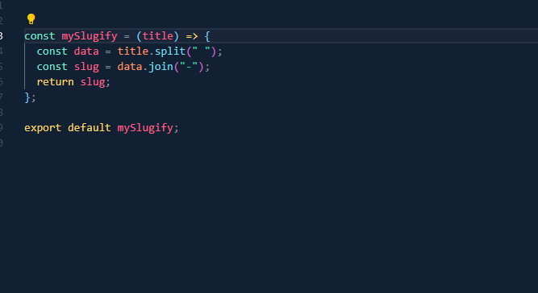
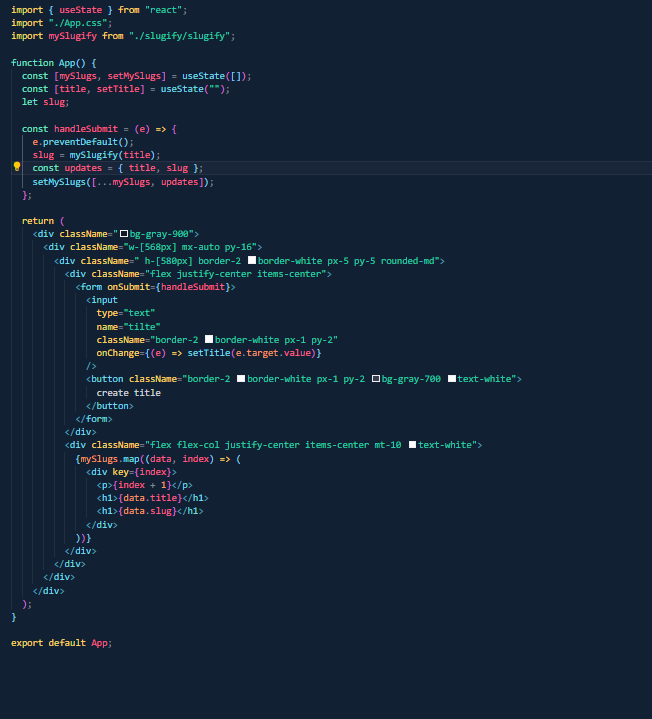

# my-slugify

## Vite

- npm create vite
- npm i
- npm run dev

## create file

- create a function
- recieve a string parameter
- split that string
- and join that split data
- at last return that data
- one more thing, export this file and access from anywhere

## two Images

